# Quiz em Java

## Introdução

Este repositório busca colocar em prática conceitos de Programação Orientada a Objetos (POO) através da
criação de um programa capaz de executar múltiplos quizzes.

Para executar a aplicação, execute a função estática `main` no arquivo `src/App.java`. Ele deve perguntar pelo
seu nome e, após isso, inicializar o quiz "História do Rock".

## Aplicação

Como os conceitos de POO foram aplicados?

### Encapsulamento:
> Todos os atributos devem ser privados com validação em setters.

A maioria dos atributos das classes neste projeto são privados, mas alguns - como os da classe abstrata 
Pergunta - foram necessários ter acesso de nível protegido (`protected`), possibilitando seu acesso de forma 
mais eficiente pelas suas subclasses.

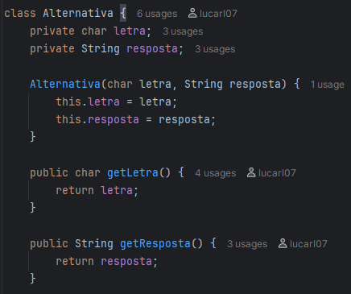

*Classe Alternativa, na qual seus atributos são privados e acessados apenas por getters*

### Herança:
> As classes PerguntaVerdadeiroFalso e PerguntaMultiplaEscolha herdam de Pergunta.

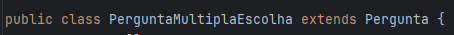
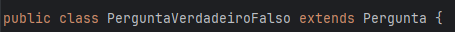

*Extensão de Pergunta pelas subclasses PerguntaMultiplaEscolha e PerguntaVerdadeiroFalso*

### Polimorfismo:
> A lista de perguntas deve ser do tipo Pergunta, armazenando diferentes subclasses.

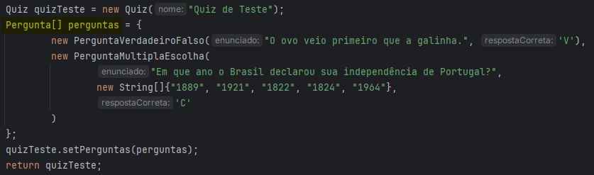

*O atributo "perguntas" armazena tanto perguntas de verdadeiro e falso, quanto perguntas de múltipla escolha.*

### Abstração:
> A classe Pergunta deve ser abstrata.

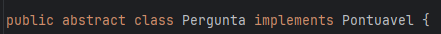

### Interface:
> Pontuavel define o método calcularPontuacao.

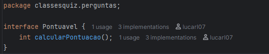

### Sobrescrita:
> Nas subclasses de Pergunta (**obrigatório:** método verificarResposta).

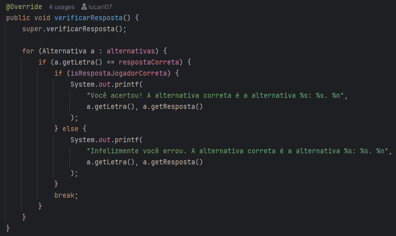

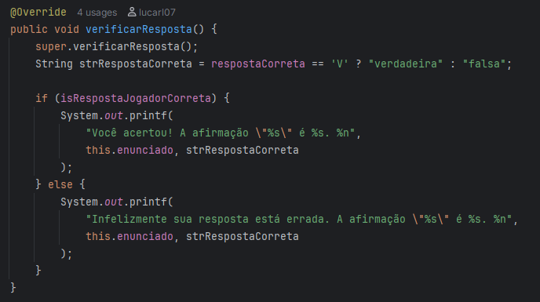

*Sobrescrita nas subclasses PerguntaMultiplaEscolha e PerguntaVerdadeiroFalso*

Além de sobrescrever o método `verificarResposta()` em ambas as subclasses de `Pergunta`, os métodos `fazerPergunta()` e
`calcularPontuacao()` também foram sobrescritos, esse último nas duas classes-filha.

### Sobrecarga:
> Na classe SistemaLogs (**obrigatório:** método registrarEvento).

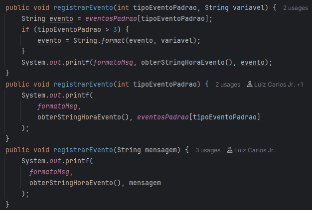

*Três métodos "registrarEvento" com diferentes assinaturas*

### Construtores com super():
> Nas subclasses de Pergunta.
 
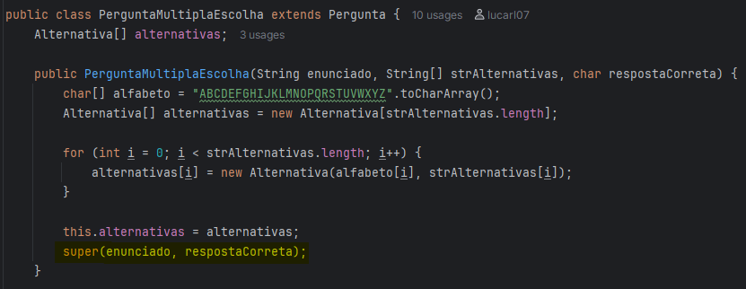

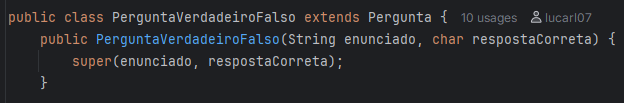

*Função construtora das subclasses de Pergunta, com a função super()*

### Atributos e métodos estáticos:
> Na classe Quiz.

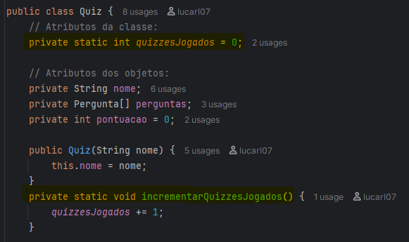

*Atributo e método estático na classe Quiz*

Aqui também é possível ver um exemplo de **composição**: o atributo `perguntas` é uma array de instâncias da classe 
`Pergunta`.

### Modificadores:
> Uso dos modificadores `private`, `public` e `protected`.

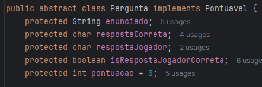

*Uso do modificador "protected", que não foi exibido nas imagens anteriores*